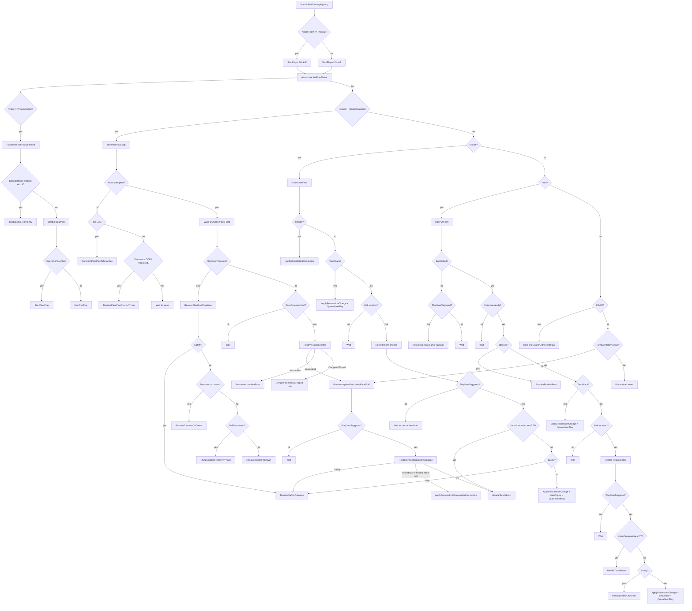

# Bank19_20 football-rules review — 2026-06-02

## Scope
Review the current `OnFieldPlayCoordinator` Bank19_20 host-flow implementation for football-rules fidelity against `reference/Tecmo_Super_Bowl_NES_Disassembly/Bank19_20_on_field_gameplay_loop.asm`, focusing on likely gameplay/rules mistakes and questionable transitions.

## Flow chart

## Findings

### 1) `AdvanceActivePlayPhase` checks `PlayType` before `TurnoverReturnActive`, which can misroute live interception returns
- File: `src/FootballGame/Gameplay/OnField/OnFieldPlayCoordinator.cs:203-233`
- Source comparison: the assembly’s interception paths jump into dedicated return loops (`P2_INTERCEPTS_PASS` / `P1_INTERCEPTS_PASS`) immediately and stay there until the return is adjudicated.
- Current risk: after `HandleInterceptionResult`, `TurnoverReturnActive` becomes true but `PlayType` is left as `Regular`. On the next coordinator tick, `AdvanceActivePlayPhase` will re-enter `RunPassPlayLoop` first whenever `IsManualPassingAllowed` is still true, or fall through to the placeholder event if manual passing is already false. That means the interception-return branch is not guaranteed to run.
- Likely gameplay effect: interceptions can continue through the wrong host loop, lose dedicated return handling, or dead-end in the placeholder path instead of following the Bank19_20 return flow.

### 2) Same-team fumble recovery can strand the coordinator in a live-return loop after the ball is already dead
- File: `src/FootballGame/Gameplay/OnField/OnFieldPlayCoordinator.cs:969-993`
- Source comparison: the assembly’s same-team recovery path only continues the live return if the ball is still live; once the play is over it falls into post-play cleanup/possession handling.
- Current risk: `HandleFumbleRecoveredByOffense` checks `if (!state.PlayOverTriggered)` before calling `RecordReturnOutcomeChecks`, but `RecordReturnOutcomeChecks` does not update `PlayOverTriggered`; it only records routine traces. If the method is entered with `PlayOverTriggered == false`, it always logs “live return continues” and returns, even if the underlying recovery should already have ended the play on that tick.
- Likely gameplay effect: same-team fumble recoveries can require an extra external state flip or stall in a pseudo-live state rather than resolving dead ball immediately.

### 3) Blocked punts are currently forced into an immediate possession change, which does not match live-ball football or the Bank19_20 source
- File: `src/FootballGame/Gameplay/OnField/OnFieldPlayCoordinator.cs:714-718`
- Source comparison: in the assembly, blocked punts stay live long enough to check the block outcome, cutscene state, touchback, return reception, and return-loop progression; even the old `P1_PUNT_BLOCKED_POSS_CHANGE_UNUSED` comment marks the immediate-possession-jump shortcut as effectively a placeholder.
- Current risk: `ResolveBlockedPunt` always flips possession immediately via `ApplyPossessionChange(..., "BLOCKED_PUNT")` and queues the next snap.
- Likely gameplay effect: blocked punts cannot be recovered/advanced correctly, and edge cases like the kicking team recovering past the line to gain or the defense scoring on the block are erased.

### 4) Missed field goals always become simple turnovers at the current LOS, missing the source’s spot-adjustment rule
- File: `src/FootballGame/Gameplay/OnField/OnFieldPlayCoordinator.cs:737-746`
- Source comparison: the assembly moves missed field goals inside the 20 back out to the 20 before the possession change (`SAVE_YARDLINE_TO_LOS_X 80`), preserving Tecmo’s field-position rule for short misses.
- Current risk: `ResolveMissedFieldGoalOrExtraPoint` just hands the ball to the other team with no explicit spot correction.
- Likely gameplay effect: short missed field goals can incorrectly give the defense the ball at the kick spot rather than the source-faithful adjusted line.

### 5) Safety handling appears to award the next kickoff to the wrong team
- File: `src/FootballGame/Gameplay/OnField/OnFieldPlayCoordinator.cs:1110-1121`
- Source comparison: when P1 is safetied in the assembly, P2 scores and the flow jumps to `P1_TO_P2_POSSESSION_CHANGE_P1_KICKOFF`, which leads into `P1_KICKOFF_START` — the scoring team receives the safety points, but the team that was safetied performs the free kick, as in normal football.
- Current risk: `ResolveSafetyOutcome` calls `ApplyPossessionChange(state, scoringTeam, "SAFETY")` and then queues a kickoff with `newOffenseTeam = scoringTeam`; `QueueNextPlayOrKickoffState` consequently sets `KickoffTeam` to the non-scoring team’s opponent and starts a kickoff flow that makes the scoring team kick off instead of receive.
- Likely gameplay effect: post-safety possession/kick direction is inverted.

### 6) Extra-point flow is modeled as an automatic kickoff transition even on blocked or failed tries, without preserving any live-ball nuance
- File: `src/FootballGame/Gameplay/OnField/OnFieldPlayCoordinator.cs:753-765, 1031-1037`
- Source comparison: the assembly’s XP loop still waits through kick/cutscene resolution and can fall out through play-over states before the kickoff transition. It does not award possession based on the XP result; it just exits the try and resumes kickoff setup.
- Current risk: `ResolveBlockedFieldGoalOrExtraPoint` and `ResolveExtraPointExitToKickoff` encode XP results as possession changes (`EXTRA_POINT_*`) rather than as a scoring-sequence exit. That is a questionable abstraction because it treats the kickoff setup as if normal possession logic changed teams, even though the kickoff direction is driven by the prior touchdown sequence.
- Likely gameplay effect: maybe not immediately user-visible if later kickoff setup overwrites state, but it muddies the rules model and increases the odds of wrong side-change banners/stats/history around XP outcomes.

## Overall assessment
The current coordinator captures much of the Bank19_20 shape, but the highest-risk football-rules gaps are around turnover-return routing and special-teams edge cases rather than ordinary run/pass dead-ball cleanup. The two most urgent parity issues are:
1. interception return flow not being guaranteed to run after `HandleInterceptionResult`; and
2. safety kickoff ownership appearing inverted.
